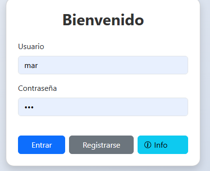
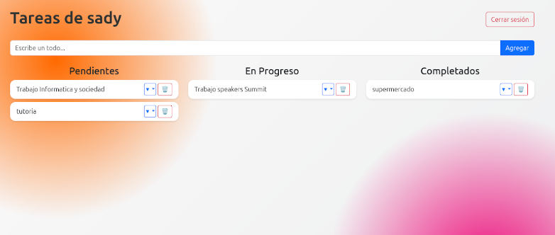
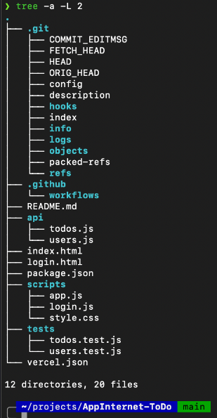
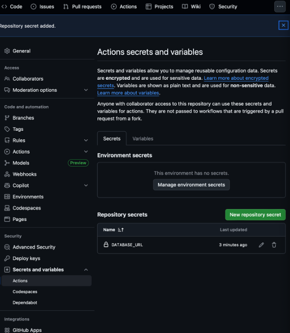
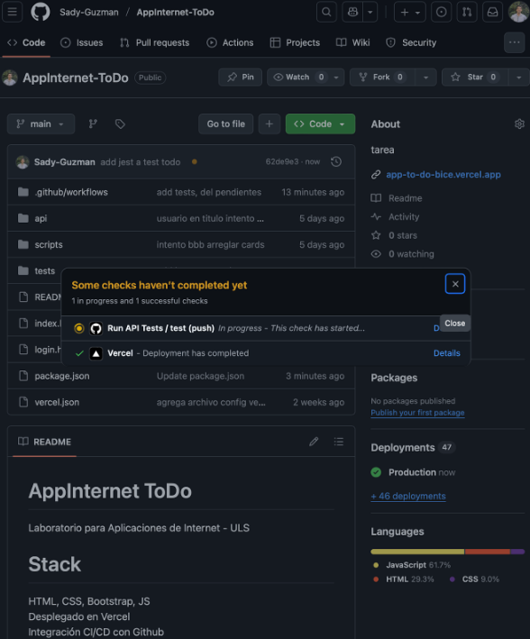
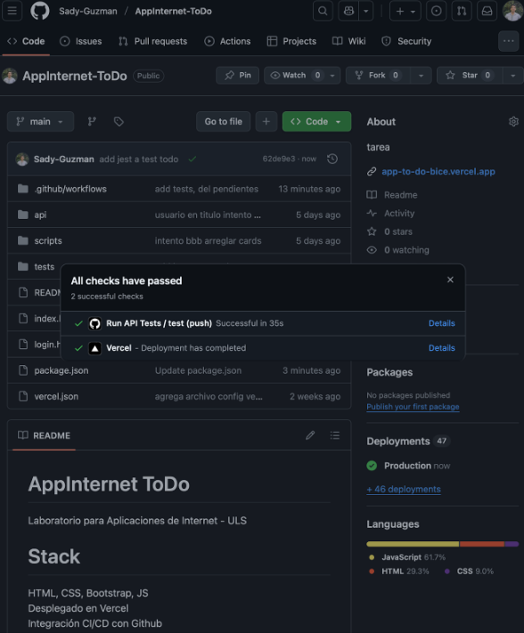

# AppInternet_ToDo

Laboratorio para Aplicaciones de Internet - ULS

## Stack

- HTML, CSS, Bootstrap, JS
- Desplegado en Vercel
- Integración CI/CD con Github
- DB serverless NEON (Postgresql)

## Demo

URL: https://todo.sady.cl/
Registrarse como usuario para ingresar.

## Screenshots

  
  

## Tests

Se prueba la vulnerabilidad del login con injecciones SQL. El proceso sanitiza correctamente los inputs maliciosos y no se logra acceder forzosamente a la aplicacion.

Se integran 2 tests con github actions que se ejecutan automaticamente con cada push al directorio del proyecto.

Verifica que endpoint de Login responde correctamente.
Verifica que se puede crear un ToDo exitosamente (POST api/todos)
  
Estructura proyecto y tests.  
  
Agrega URL de NEON como secreto al repositorio.  
  
Tests ejecutandose al hacer un push al repositorio  
  
Tests aprobados.  

## Api Endpoints             

| N | Método | Endpoint | Descripción | ​
| --- | --- | --- | --- | ​
| 1 | POST | /api/users/register | Registro de nuevo usuario | ​
| 2 | POST | /api/users/login | Login; devuelve token/cookie; el cliente puede guardar user_id | ​
| 3 | GET | /api/todos?user_id=X | Cargar tareas del usuario al abrir el dashboard | ​
| 4 | POST | /api/todos | Agregar tarea | ​
| 5 | PATCH | /api/todos/:id | Cambiar estado de una tarea | ​
| 6 | DELETE | /api/todos/:id | Eliminar tarea |
